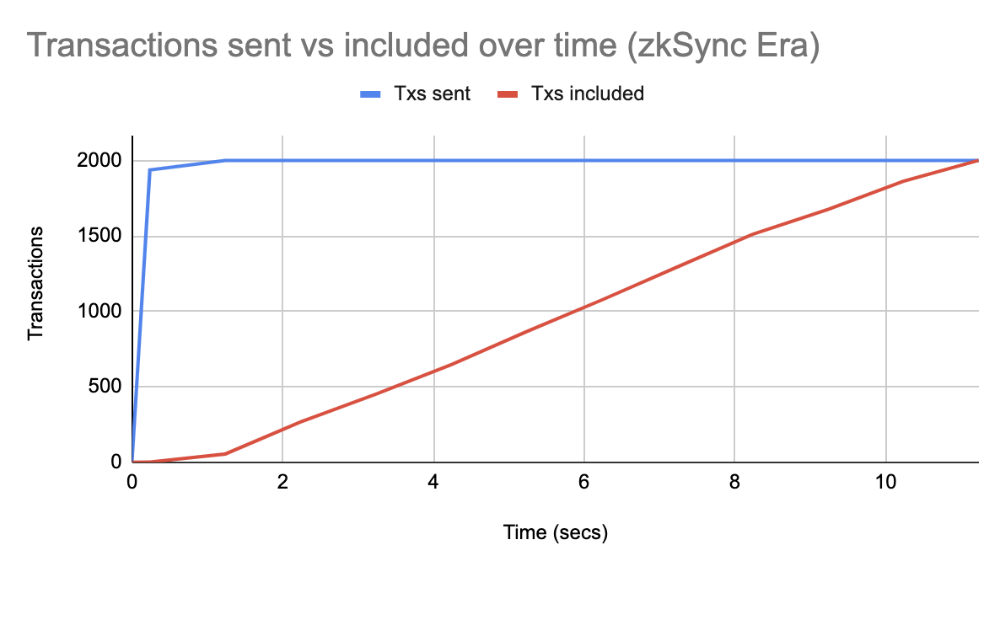
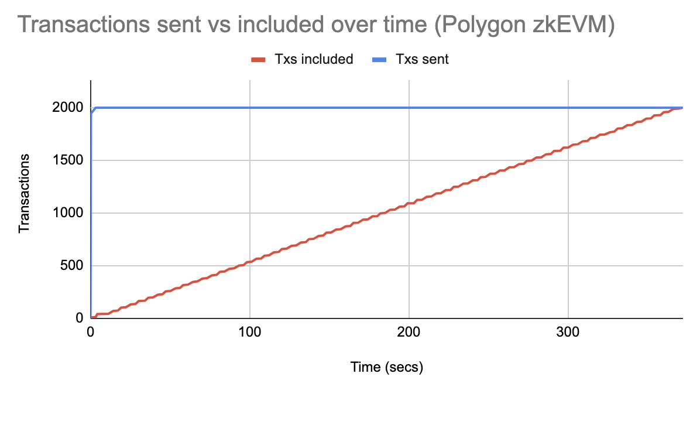

# AMM TPS test for ZKsync Era, Polygon zkEVM, and OP Mainnet

Our goal was to benchmark maximal transaction throughput (TPS) for ZKsync Era, Polygon zkEVM and OP Mainnet.
We settled on the [time-tested AMM test](https://medium.com/dragonfly-research/the-amm-test-a-no-bs-look-at-l1-performance-4c8c2129d581), i.e. measuring the TPS via the number of token swaps through a Uniswap V2 AMM style pool.
Using the AMM test as a reasonable apples-to-apples comparison was popularized by Dragonfly Research; see also [discussion](https://twitter.com/gakonst/status/1784332678931894598) by Georgios (Paradigm) against non-specific TPS, plus [here](https://twitter.com/0xsudogm/status/1805613746876039556).

This repository includes scripts designed for executing predefined WETH -> CAKE V2 swaps simultaneously from multiple accounts. Additionally, it contains helper scripts to analyze blockchain performance metrics post-execution.

The overall **TPS (transactions per second)** is calculated by dividing the total number of transactions sent by the total time in seconds between the moments the first and last transactions were included (last_block_timestamp - first_block_timestamp).

## Results

### ZKsync Era Results
- From 100 different accounts, 20 V2-swaps were sent by each in parallel
- We used the official WS RPC for sending transactions
- 2000 transactions total, split across 10 IP addresses to avoid RPC limits
- It took 11s for all transactions to be included with overall throughput of **181.8 tx/s**
- On-chain data: 11 blocks from [36612894](https://explorer.zksync.io/block/36612894) to [36612904](https://explorer.zksync.io/block/36612904) are almost exclusively our swaps

### Polygon zkEVM Results
- From 100 different accounts, 20 V2-swaps were sent by each in parallel
- We have not been able to find an official Polygon zkEVM WS RPC. Thus, we used the paid version of WS API on dRPC.org, as the fastest we could find https://chainlist.org/chain/1101
- 2000 transactions total, split across 10 IP addresses to avoid RPC limits
- It took 372s for all transactions to be included with relatively steady TPS of **5.4 tx/s**
- On-chain data: 131 blocks from [13686722](https://zkevm.polygonscan.com/block/13686722) to [13686852](https://zkevm.polygonscan.com/block/13686852) are almost exclusively our swaps

### Optimism OP Mainnet Results
- Estimating OP Mainnet throughput with confidence is easier
- For Optimism Mainnet, the block size is 30M gas, block time is 2 seconds, and an average AMM trade requires roughly 105k gas. Thus the maximum possible TPS on Optimism Mainnet is roughly 30M / 2sec / 105k ~= **142.8 tx/s**
- We obtained this TPS in practice: blocks between [121963262](https://optimistic.etherscan.io/block/121963262) and [121963269](https://optimistic.etherscan.io/block/121963269)

## Technical Details

**High-Level Overview:**
- `blockchain.py`: Manages addresses and endpoints for specified chain IDs. This class is extendable for tps-tests on other chains, though it is crucial to ensure that any newly added tokens possess sufficient V2 liquidity for trading.
- `prepare.py`: Implements the logic to fund accounts (derived from a mnemonic) with ETH. It also handles wrapping and approving ETH for the SmartRouter to spend.
- `tps_test.py`: Executes a specified number of WETH -> CAKE swaps via a websocket RPC endpoint from each account concurrently.
- `logs_parser.py`: Analyzes the logs by organizing swap transactions based on the time they were sent, identifying the corresponding block for each transaction, organizing these blocks, and finally calculating the TPS to provide insights into the dynamics of transaction inclusion and blockchain performance.

**Suggested TPS-test setup:**
1) Fund 100 accounts with 0.002 ETH  (`prepare.py`)
2) Wrap 0.00000005 WETH for each account (`prepare.py`)
3) Approve spending 1 WETH for SmartRouter for each account (`prepare.py`)
4) Run 10 instances of `tps_test.py` from different IPs. This can be achieved by operating the script on 10 distinct servers or by setting up iptables rules to alternate source IPs based on the user. 
You can configure sending accounts by specifying -n flag: 
`tps_test.py -n 0 2>&1 | tee logs/tps00.log`  // will send swaps from accounts #0...#9 
`tps_test.py -n 1 2>&1 | tee logs/tps01.log`  // will send swaps from accounts #10...#19 
... 
`tps_test.py -n 9 2>&1 | tee logs/tps09.log`  // will send swaps from accounts #90...#99 
To synchronize start times, the script include logic to delay execution until the next 5-minute mark. For example, if a script launches at 15:02:34, it will commence at 15:05:00.
5) Combine all `tps0*.log` into `tps.log` by running `cat tps0{0..9}.log > tps.log`
6) Create `swaps.log` using `logs_parser.py` - the list of all sorted transactoins [(example)](https://gist.github.com/sanekmelnikov/447f9b8603df882bafd31f35b82b939c)
7) Create `tps-results.log` using `logs_parser.py` - the list of blocks and final TPS result [(example)](https://gist.github.com/sanekmelnikov/c6d79a30708ded1828ac5e7a371a7eac)

**Recent TPS Results:**
- zkSync Era Mainnet: **181.8 txs/s** (Date: 14 June 2024, spent in swap tx fees: ~0.007 ETH) [[tps-results]](https://gist.github.com/sanekmelnikov/c6d79a30708ded1828ac5e7a371a7eac)
- Optimism Mainnet: **142.8 tx/s** (Date: 27 June 2024, spent in swap tx fees: ~0.0007 ETH) [[tps-results]](https://gist.github.com/sanekmelnikov/4738d8bbf8db6b48cd1c527854cf6a32)
- Polygon zkEVM Mainnet: **5.4 txs/s** (Date: 25 June 2024, spent in swap tx fees: ~0.042 ETH) [[tps-results]](https://gist.github.com/sanekmelnikov/075978aa29896f259baa0517a12b66a2)
